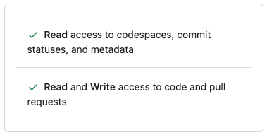
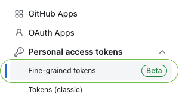
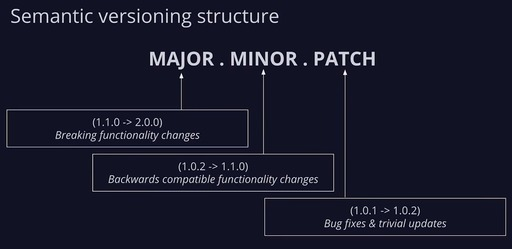

# Release Management Action
Github action for managing the release version and tags based on the release type. In GitHub action inspires from the [release-please-action](https://github.com/google-github-actions/release-please-action) Github action.

## Setting up this action

1. If you haven't already done so, create a `.github/workflows` folder in your
  repository (_this is where your actions will live_).

2. Now create a `.github/workflows/release-tagging.yml` file with these contents:
``` yaml
name: Release Management

on:
  pull_request:
    types: [ closed ]
    branches:
      - main

jobs:
  init-release:
    if: github.event.pull_request.merged && (startsWith(github.event.pull_request.head.ref, 'release/') || startsWith(github.event.pull_request.head.ref, 'feat/') || startsWith(github.event.pull_request.head.ref, 'dev/') || startsWith(github.event.pull_request.head.ref, 'hotfix/') || startsWith(github.event.pull_request.head.ref, 'fix/'))
    runs-on: ubuntu-latest
    name: Create Release PR
    steps:
      - name: Release
        uses: StotteAdmin/release-management-action@v1.0.3
        with:
          token: ${{ secrets.GITHUB_TOKEN }}
          config-path: .github/config/release-management.yaml
          release-prefix: v
          action: release-pr 
  release:
    if: github.event.pull_request.merged && startsWith(github.event.pull_request.head.ref, 'auto-release/')
    runs-on: ubuntu-latest
    name: Tagging and Releasing
    steps:
      - name: Release
        uses: StotteAdmin/release-management-action@v1.0.3
        with:
          token: ${{ secrets.GITHUB_TOKEN }}
          config-path: .github/config/release-management.yaml
          release-prefix: v
          action: release
```

For functioning this this action it requires, Github access token with following permissions.
- **Read access** to codespaces, commit statuses, and metadata
- **Read and Write access** to code and pull requests

> **Note:** Please always create a fine grained token in Github level with only specific repository.

<p align='center'> </p> <p align='center'> Figure 1 : GitHub Token Permission </p> 
<hr>
<p align='center'> </p> <p align='center'> Figure 2 : GitHub Token Type </p> 

## Features
- Automatically managed Github tagging and releasing based on the pull request's branch prefix.
> _As an example,_
if it have been merged branch which starts from `release/` it increase the minor version number. ex - `v1.0.1` to `v1.2.0`.
If the PR branch starts with `hotfix/` prefix, it increase the patch release number.
ex - `v1.0.1` to `v1.0.2`

<p align='center'> </p> <p align='center'> Figure 3 : Semantic Versioning </p> 

- Update CHANGELOG.md file based on release feature and fixes. This categorization will handle based on the commit name prefixes.
- Automatically update `package.json` file's `version` property
> **Note:**
As an example this will update,
-- Root level `package.json` file


#### How should Developer write commits?

The most important prefixes you should have in mind are:

* `fix:` which represents bug fixes, and correlates to a [SemVer](https://semver.org/)
  patch. These Commits automatically identifies as _Bug Fixes_.
* `feat:` which represents a new feature, and correlates to a SemVer minor. These commits identifies as _Features_.
* `chore:` or any other prefix based commits are identified as _Other Commits_.


## For Maintainers

As general, this Github action also use ncc to package the code in to single js file. So in the development please globally install ncc first.

```sh
npm i -g @vercel/ncc --save
```

After your development, please execute following command for building the package file, then push the code to GitHub.

```sh
npm run build
```

## Developers

- [Huzaifa Asif](huzaifa@creativeheads.no)
